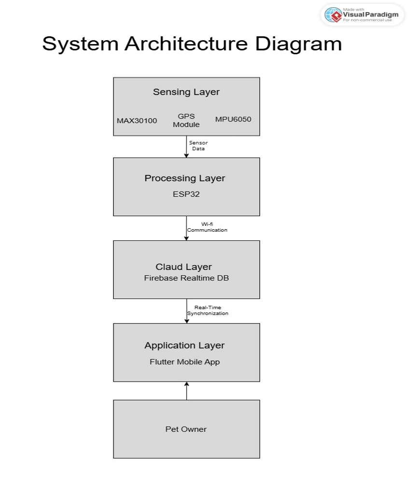
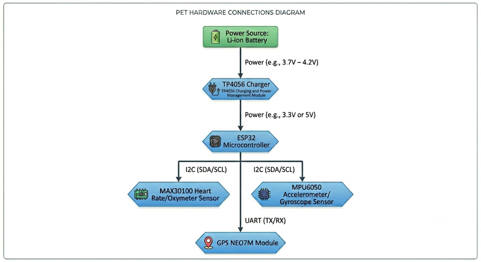
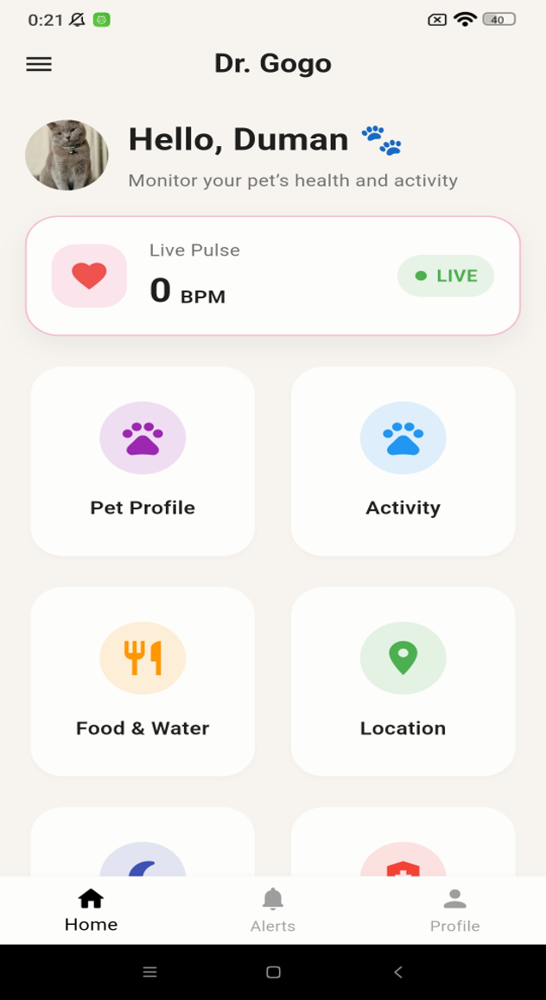
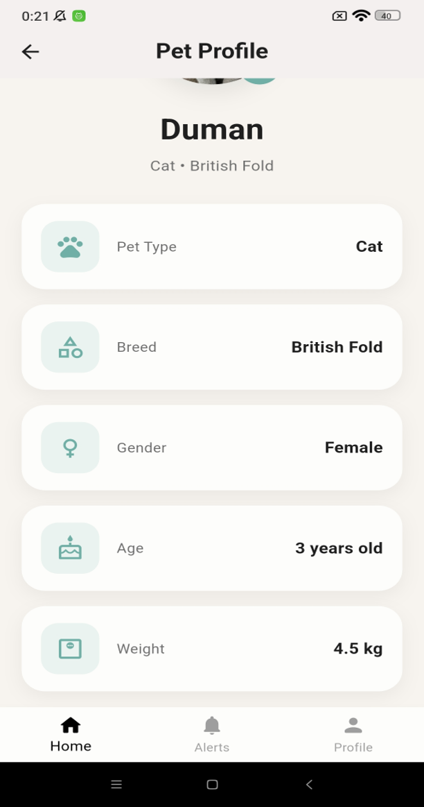
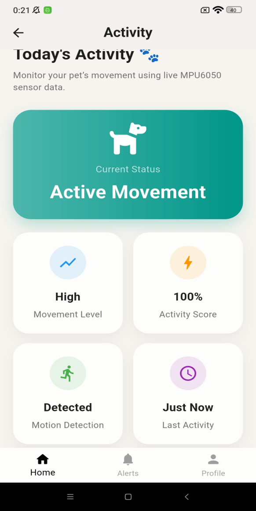
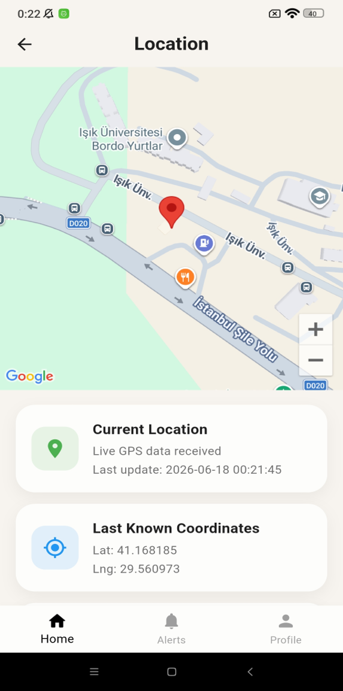
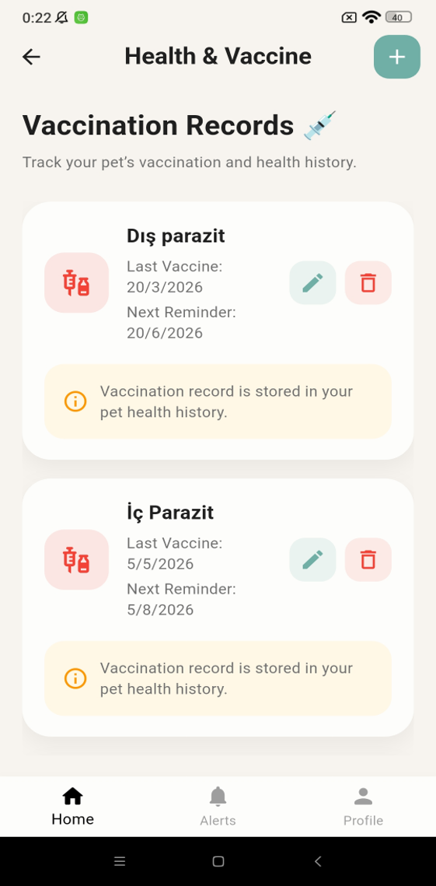

# 🐾 Dr. Gogo
### Integrated Health and Support System for Pets

> **TÜBİTAK 2209-A Supported Project & Graduation Project**  
> Işık University – Management Information Systems

Dr. Gogo is an IoT-based integrated health and support system designed to help pet owners monitor their pets' health, activity, location, and daily care information through a single mobile application.

The project combines wearable sensor technologies, IoT infrastructure, cloud-based real-time data management, and a Flutter mobile application to create an end-to-end pet monitoring system.

---

## 📌 About the Project

Dr. Gogo was developed as both my **graduation project at Işık University** and a project supported within the **TÜBİTAK 2209-A University Students Research Projects Support Program**.

The project was developed through the complete project lifecycle, including requirements analysis, system design, hardware integration, mobile application development, cloud infrastructure, testing, documentation, and final delivery.

The main goal of the system is to collect health, activity, and location data from a pet using wearable sensors, process this data through a microcontroller, transfer it to a cloud infrastructure, and make it accessible to the pet owner through a mobile application.

---

## ✨ Key Features

- ❤️ Real-time heart rate monitoring
- 🐾 Activity and movement tracking
- 📍 GPS-based location tracking
- 💉 Health and vaccination records
- 🍽️ Food and water tracking
- 🐱 Pet profile management
- ☁️ Real-time cloud synchronization
- 📱 Flutter-based mobile application
- 🔌 IoT-based sensor integration

---

## 🏗️ System Architecture

The Dr. Gogo system was designed as an integrated architecture connecting wearable sensors, an ESP32 microcontroller, cloud infrastructure, and the mobile application.

### System Architecture Diagram



### Data Flow

```text
Sensors → ESP32 → Wi-Fi → Firebase Realtime Database → Flutter Mobile Application → User
```

The architecture consists of four main layers:

### 1. Sensing Layer
- MAX30100 Heart Rate Sensor
- MPU6050 Accelerometer & Gyroscope
- GPS Module

### 2. Processing & Communication Layer
- ESP32 Microcontroller
- Wi-Fi Communication

### 3. Cloud Layer
- Firebase Realtime Database
- Real-time Data Synchronization

### 4. Application Layer
- Flutter Mobile Application
- User-friendly monitoring interface

---

## 🔌 Hardware Architecture

The wearable prototype integrates multiple sensors with the ESP32 microcontroller to collect health, movement, and location information.



### Hardware Components

- **ESP32** – Main microcontroller and communication unit
- **MAX30100** – Heart rate monitoring
- **MPU6050** – Movement and activity detection
- **GPS Module** – Location tracking
- **Wi-Fi** – Communication with Firebase

---

## 🛠️ Technologies

### Mobile Development
- Flutter
- Dart

### Cloud & Database
- Firebase
- Firebase Realtime Database

### IoT & Hardware
- ESP32
- MAX30100
- MPU6050
- GPS Module

### Development Tools
- Git
- GitHub

---

# 📱 Mobile Application

The Dr. Gogo mobile application was developed using **Flutter** and designed to bring different pet monitoring and care functions together within a single interface.

The application communicates with **Firebase Realtime Database** to display the latest information transferred from the IoT hardware.

---

## 🏠 Dashboard

The main dashboard provides centralized access to the core modules of the application, including pet profile, activity, food & water, location, and health information.



---

## 🐱 Pet Profile

The Pet Profile module allows users to manage their pet's basic information.

The profile includes information such as:

- Pet name
- Breed
- Age
- Gender
- Weight
- Profile information



---

## 🐾 Activity Tracking

Activity and movement information is collected using the **MPU6050 accelerometer and gyroscope sensor**.

The sensor data is processed through the ESP32 and transferred to Firebase, allowing activity information to be accessed through the mobile application.



---

## 📍 Location Tracking

The GPS module collects geographical coordinates from the wearable system.

The coordinates are transferred through the ESP32 to Firebase and displayed in the mobile application, allowing the pet's location information to be monitored.



---

## 💉 Health & Vaccination Tracking

The application includes a dedicated module for managing health and vaccination information.

This allows pet owners to keep important health-related records together with the monitoring features of the system.



---

## 🔄 How It Works

The system operates through an end-to-end data flow:

1. Sensors collect health, movement, and location data from the pet.
2. The **ESP32** receives and processes the sensor data.
3. The processed data is transmitted through Wi-Fi.
4. **Firebase Realtime Database** stores and synchronizes the information.
5. The **Flutter mobile application** retrieves the latest data.
6. The pet owner can access the information through the application.

This structure enables communication between the physical IoT hardware, cloud infrastructure, and mobile application.

---

## 🧪 Testing & Results

The hardware, Firebase infrastructure, and Flutter mobile application were tested together as an integrated system.

During the testing process:

- Heart rate data was obtained from the **MAX30100** sensor.
- Movement data was collected using the **MPU6050** sensor.
- Location coordinates were obtained through the **GPS module**.
- Sensor data was transferred to Firebase through the **ESP32**.
- Firebase data was synchronized with the Flutter application.
- Updated sensor information could be displayed in the application without requiring manual refresh.

As a result of the development and testing process, a functional prototype integrating **IoT hardware, cloud infrastructure, and a mobile application** was successfully developed.

---

## 🚀 Future Improvements

The project was designed with an extensible architecture that can support additional technologies and features in future versions.

Potential future improvements include:

- 🤖 AI-assisted health analysis
- ⚠️ Intelligent anomaly detection
- 📊 Predictive health monitoring
- 🔔 Advanced health alerts
- 🧠 Analysis of historical health and activity data
- ⌚ Integration of additional wearable health sensors

> **Note:** AI-based predictive health analysis and advanced anomaly detection are planned future improvements and are not implemented features of the current prototype.

---

## 🎓 Project Outputs

The project resulted in both technical and academic outputs:

- Functional IoT-based pet monitoring prototype
- Flutter mobile application
- Firebase-based real-time data infrastructure
- Wearable sensor system
- TÜBİTAK 2209-A Final Report
- Graduation Project Report
- Project Presentation
- Project Poster

---

## 💡 What I Gained From This Project

Developing Dr. Gogo allowed me to experience the complete lifecycle of a technology project, from the initial idea to final delivery.

Throughout the project, I worked on:

- Requirement analysis
- System architecture design
- Hardware selection and integration
- Sensor integration
- Mobile application development
- Firebase integration
- Cloud-based real-time data management
- System testing
- Problem solving
- Technical documentation
- TÜBİTAK final report preparation
- Final project delivery

The project provided hands-on experience in developing a system that combines **software development, IoT hardware, cloud technologies, database management, and mobile development** within a single integrated solution.

---

## 👩‍💻 Author

**Büşranur Atalay**

Management Information Systems  
Işık University – 2026 Graduate

**GitHub:** [busratalayy](https://github.com/busratalayy)

---

## 📄 Project Information

**Project Name:** Integrated Health and Support System for Pets (Dr. Gogo)  
**Program:** TÜBİTAK 2209-A University Students Research Projects Support Program  
**University:** Işık University  
**Department:** Management Information Systems  
**Graduation Year:** 2026
